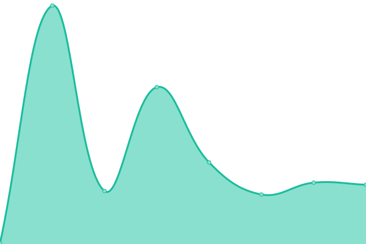
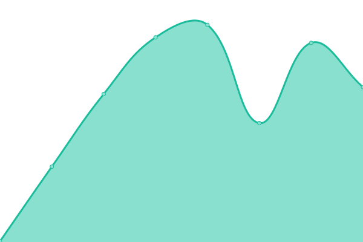

# [📈 Live Status](https://status.bartop.xyz): <!--live status--> **🟩 All systems operational**

This repository contains the open-source uptime monitor and status page for [Michael Van Der Velden](https://mikevdv.dev), powered by [Upptime](https://github.com/upptime/upptime).

With [Upptime](https://upptime.js.org), you can get your own unlimited and free uptime monitor and status page, powered entirely by a GitHub repository. We use [Issues](https://github.com/vandie/bartop-uptime/issues) as incident reports, [Actions](https://github.com/vandie/bartop-uptime/actions) as uptime monitors, and [Pages](https://status.bartop.xyz) for the status page.

<!--start: status pages-->
<!-- This summary is generated by Upptime (https://github.com/upptime/upptime) -->
<!-- Do not edit this manually, your changes will be overwritten -->
<!-- prettier-ignore -->
| URL | Status | History | Response Time | Uptime |
| --- | ------ | ------- | ------------- | ------ |
|  [PWA & App Systems](https://app.bartop.xyz) | 🟩 Up | [pwa-and-app-systems.yml](https://github.com/BartopXYZ/uptime/commits/HEAD/history/pwa-and-app-systems.yml) | 

 160ms
     
 | 

<a href="https://status.bartop.xyz/history/pwa-and-app-systems">100.00%</a>
    

|  API | 🟩 Up | [api.yml](https://github.com/BartopXYZ/uptime/commits/HEAD/history/api.yml) | 

 512ms
     
 | 

<a href="https://status.bartop.xyz/history/api">100.00%</a>
    

|  Database | 🟩 Up | [database.yml](https://github.com/BartopXYZ/uptime/commits/HEAD/history/database.yml) | 

 500ms
     
 | 

<a href="https://status.bartop.xyz/history/database">0.00%</a>
    

|  [Dashboard Systems](https://bartop.xyz) | 🟩 Up | [dashboard-systems.yml](https://github.com/BartopXYZ/uptime/commits/HEAD/history/dashboard-systems.yml) | 

 243ms
     
 | 

<a href="https://status.bartop.xyz/history/dashboard-systems">100.00%</a>
    

<!--end: status pages-->

[**Visit our status website →**](https://status.bartop.xyz)

## 📄 License

- Powered by: [Upptime](https://github.com/upptime/upptime)
- Code: [MIT](./LICENSE) © [Michael Van Der Velden](https://mikevdv.dev)
- Data in the `./history` directory: [Open Database License](https://opendatacommons.org/licenses/odbl/1-0/)
